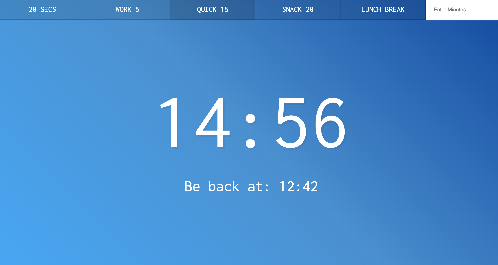

# Video Speed Controller
Day 29 of Javascript30 by WesBos. Made a site where you can set timers for 5 - 20 minutes for your work or for any activity. You can also set a custom typed time in minutes. After entering it, it will display on the screen and will the countdown will start.

# Demo

# Technologies Used
HTML5, CSS, Vanilla JS

# Website
https://buigabor.github.io/countdown-timer/